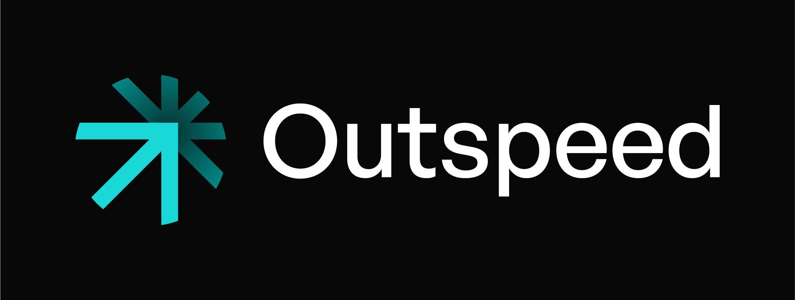

<p align="center">
  <a href="https://outspeed.ai" target="_blank">
    <picture>
      <source srcset="./assets/logo-white.webp" media="(prefers-color-scheme: dark)" />
      <source srcset="./assets/logo-black.webp" media="(prefers-color-scheme: light)" />
      
    </picture>
  </a>
</p>

The `outspeed-js` library provides a simple API that facilitates easy connection to the `outspeed` backend, enabling streaming of local audio, video, and screen content. This is a monorepo containing all packages related to web and JavaScript.

# Documentation

You can read the [docs](http://docs.outspeed.ai/) to learn more about the SDK.

# Installation

To install `outspeed-js` in your existing React application, run the following command:

```bash
npm i @outspeed/core @outspeed/react

# or
yarn add @outspeed/core @outspeed/react

# or 
pnpm i @outspeed/core @outspeed/react
```

This will add `@outspeed/core` and `@outspeed/react` to your project's dependencies.

# Usage

We assume you've already deployed your backend using [`outspeed`](https://github.com/outspeed-ai/outspeed) and have a function URL available. If not, please follow the instructions provided [here](https://github.com/outspeed-ai/outspeed). Additionally, the backend should be using `WebRTC`.

To establish a connection, you can use the `useWebRTC` hook as shown below:

```tsx
import React from "react";
import { useWebRTC, RealtimeVideo } from "@outspeed/react";

export function App() {
  const { connect, connectionStatus, getRemoteVideoTrack, getLocalVideoTrack } = useWebRTC({
    functionURL: "<myfunctionurl>", // Add your function URL.
    audio: true,
    video: true,
  });

  return (
    <div>
      {connectionStatus === 'New' && <button onClick={connect}>Connect</button>}
      <RealtimeVideo track={getRemoteVideoTrack()} />
      <RealtimeVideo track={getLocalVideoTrack()} />
    </div>
  );
}
```


